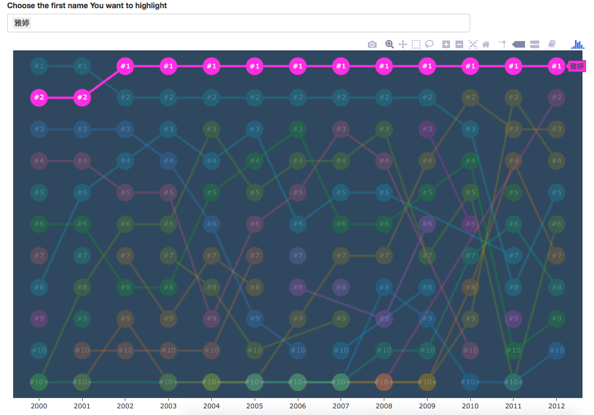

# Bump Charts in R


## TL;DR

This visualization shows the popularity trend of the top 10 first name in 2012 between 2000 and 2012 according to yearly rank of names. There are names which were not always in the top 10 between the selected period that's why there is a "10+" line in the bottom. You can highlight any name by clicking on it or You can also select any of it from the drop-down list.



## Get Started

```shell
# Install required packages
$ Rscript -e 'intsall.packages(c("readxl", "ggplot2", "plotly", "crosstalk", "shiny", "scales", "httr", "dplyr"))'

# Run Shiny
$ Rscript -e "shiny::runApp(port=8899)"
```

## Dataset

- [Hungarian first name database @data.world](https://data.world/tarkomatas/hungarian-first-and-middle-name-database-1954-2016)
- [Common Chinese Names](http://technology.chtsai.org/namefreq/)

## Requirements

```
[1] httr_1.4.0      scales_1.0.0    shiny_1.2.0     crosstalk_1.0.0
[5] plotly_4.8.0    ggplot2_3.1.0   readxl_1.2.0 
```

## References

- https://www.r-bloggers.com/bump-charts-in-r/amp/
- [Tableau - Car Color Evolution North America](https://public.tableau.com/profile/matt.chambers#!/vizhome/CarColorEvolutionNorthAmerica/ColorRankOverTime)
